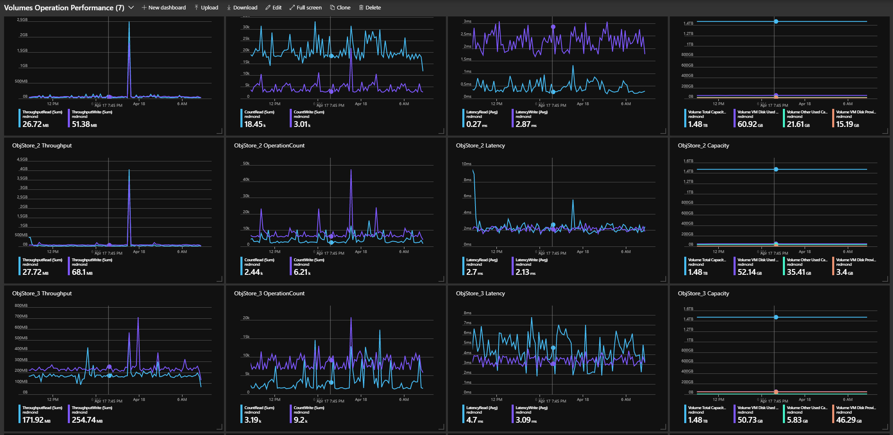

# AzureStack-VolumesPerformanceDashboard-Generator
This tool is used to generate dashboard jsons showing volumes performance used on Azure Stack Hub Admin portal.

### Example
- default json save to spedified location  
`.\Create-AzSStorageDashboard.ps1 -timeGrain "PT15M" -outputLocation '.' `
- data of last week with 1 hour interval  
`.\Create-AzSStorageDashboard.ps1 -duration "P7D" -timeGrain "PT1H"`
- date from 4/1 to 4/8 with 1hr interval  
`.\Create-AzSStorageDashboard.ps1 -startTime (Get-date("2019-04-01")) -endTime (Get-date("2019-04-08")) -timeGrain "PT1H"`
- Tip: The latest AzureStack (version 2005) has a dashboard level time range selector at the top left corner of dashboard. So you do not need to specify time interval here.

### Feature
- User can specify time range by duration or startTime & endTime.
- User can specify eight types of time granularity. Default type is ‘Automatic’, which adapted to time range.
- Generate multiple json files representing different volume types.

### Prerequisite
- Login to the Azure Stack Hub Admin ARM Endpoint using either AzureRM or Az module. 

### Usage   
1. Execute Create-AzSStorageDashboard.ps1 with needed parameters. 
2. Upload json generated on Admin Portal dashboard, this has to be done on a per user basis.  

### Add new metrics
Change ps1 file. Adapt function Initialize-TilePsCustomObject and Get-TilePsCustomObject, then register in initialized variable metricTypes. 
