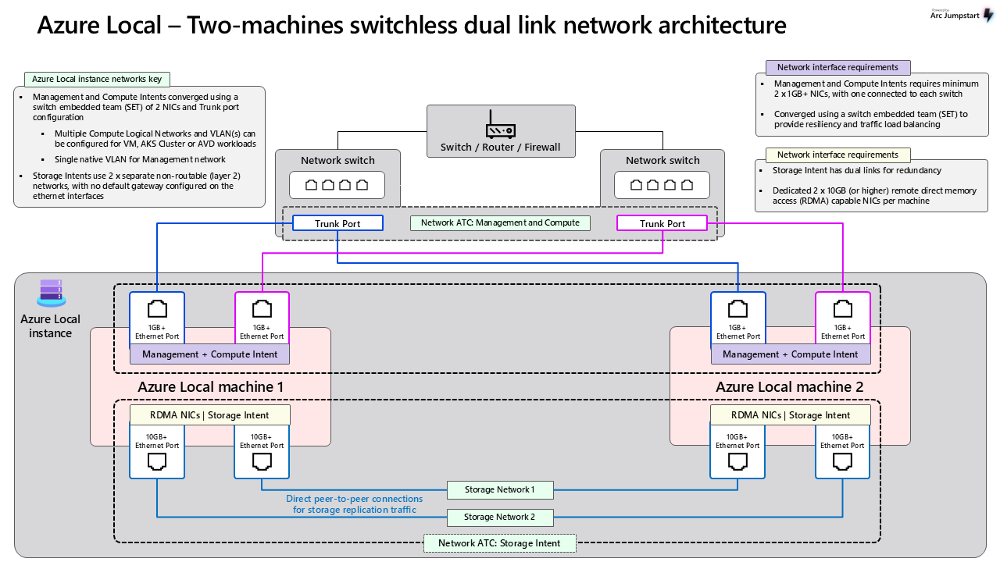

# Azure Local Two Node Switchless Storage Configuration

**DRAFT**

- [Azure Local Two Node Switchless Storage Configuration](#azure-local-two-node-switchless-storage-configuration)
  - [Terminology](#terminology)
  - [Example Device](#example-device)
  - [Scope](#scope)
  - [Two Node Switchless environment](#two-node-switchless-environment)
  - [Attributes](#attributes)
    - [Nodes](#nodes)
  - [Cable Map](#cable-map)
    - [Node 1](#node-1)
    - [Node 2](#node-2)
    - [TOR 1](#tor-1)
    - [TOR 2](#tor-2)
  - [Switches](#switches)
  - [Switch Configuration](#switch-configuration)
    - [QOS policy](#qos-policy)
    - [Compute, Management Intent Networks](#compute-management-intent-networks)
  - [ToR Configuration](#tor-configuration)
    - [Required Switch Features](#required-switch-features)
    - [Host Side configuration](#host-side-configuration)
    - [MLAG Connection](#mlag-connection)
    - [Example Routing](#example-routing)
  - [Example SDN configuration](#example-sdn-configuration)
  - [Layer 3 Forwarding Gateway](#layer-3-forwarding-gateway)
    - [BGP Mode](#bgp-mode)
    - [Static Mode](#static-mode)
  - [Reference Documents](#reference-documents)



## Terminology

- **ToR**: Top of Rack switch
- **p-NIC**: Physical Network Card attached to a node.
- **v-Switch**: Virutal Switch configured on the Azure Local Cluster.
- **VLAN**: Virutal Local Area Network.
- **SET**: Switch Embedded Teaming, supporting switch independant teaming.
- **MLAG**: (Multi-Chassis Link Aggregation) It's a technique that lets two or more network switches work together as if they were one big switch.
- **Border Router**: This is considered an uplink device with the ToR devices, it provides routing capabilities to endpoint external to the Azure Local environment.
- **AS**: Autonomous System number used to define as BGP neighbor.

## Example Device

- **Make**: Cisco
- **Model**: Nexus 98180YC-FX
- **Firmware**: 10.3(4a)

## Scope

This document is intended to assist administrators in designing a network architecture that aligns with their cluster configuration requirements. It provides reference architectures for network devices that support cluster deployments, along with sample configurations tailored for these environments. Equipment located on the customer premises—such as switches, firewalls, or routers—is considered out of scope for this document, as it is assumed to be part of the existing customer infrastructure supporting the broader network fabric. The focus of this document is on Node-to-ToR (Top of Rack) and ToR-to-ToR configurations, as well as uplink configurations from the ToR perspective.

## Two Node Switchless environment

In this configuration, a two-node environment is deployed using an Azure Local switchless storage architecture. Storage traffic is directly connected between the two nodes, bypassing any network switches to reduce latency and complexity for storage workloads. The Top-of-Rack (ToR) switches in this design are dedicated solely to supporting compute and management traffic. These network intents are able to utilize both ToR devices, providing redundancy and high availability for cluster operations. The physical NICs (p-NICs) responsible for compute and management traffic are configured with Switch Embedded Teaming (SET), enabling switch-independent teaming and allowing seamless communication with the physical network infrastructure.

This approach ensures that storage traffic remains isolated and optimized through direct node-to-node connections, while compute and management traffic benefit from the resiliency and scalability provided by dual ToR switches and MLAG/vPC configurations.

## Attributes

The two node converged networking configuration has the following attributes.

### Nodes

1. Each node is equipped with two physical network interface cards, each of the cards has two physical network card interfaces. Each card interface will be labeled as a p-NIC.
2. p-NIC A,B are responsible for handling both compute and management traffic.
3. p-NIC A,B are configured as part of a Switch Embedded Teaming (SET) team, where compute and management traffic are transmitted using VLAN tags. These NICs are assigned to a virtual switch (v-Switch) to support multiple network intents.
4. p-NIC C,D are dedicated to storage traffic and supports RDMA protocol workloads.
5. p-NIC C,D are directly connected between node 1 and node 2, with traffic transmitted using VLAN tags over this direct connection.

## Cable Map

### Node 1

| Device    | Interface |      | Device | Interface   |
| --------- | --------- | ---- | ------ | ----------- |
| **Node1** | p-NIC A   | <==> | TOR1   | Ethernet1/1 |
| **Node1** | p-NIC B   | <==> | TOR2   | Ethernet1/1 |
| **Node1** | p-NIC C   | <==> | Node2  | p-NIC C     |
| **Node1** | p-NIC D   | <==> | Node2  | p-NIC D     |

### Node 2

| Device    | Interface |      | Device | Interface   |
| --------- | --------- | ---- | ------ | ----------- |
| **Node2** | p-NIC A   | <==> | TOR1   | Ethernet1/2 |
| **Node2** | p-NIC B   | <==> | TOR2   | Ethernet1/2 |
| **Node2** | p-NIC C   | <==> | Node1  | p-NIC C     |
| **Node2** | p-NIC D   | <==> | Node1  | p-NIC D     |

### TOR 1

| Device   | Interface    |      | Device  | Interface    |
| -------- | ------------ | ---- | ------- | ------------ |
| **TOR1** | Ethernet1/1  | <==> | Node1   | p-NIC A      |
| **TOR1** | Ethernet1/2  | <==> | Node2   | p-NIC B      |
| **TOR1** | Ethernet1/1  | <==> | Node1   | p-NIC A      |
| **TOR1** | Ethernet1/2  | <==> | Node2   | p-NIC B      |
| **TOR1** | Ethernet1/41 | <==> | TOR2    | Ethernet1/41 |
| **TOR1** | Ethernet1/42 | <==> | TOR2    | Ethernet1/42 |
| **TOR1** | Ethernet1/47 | <==> | Border1 | Ethernet1/x  |
| **TOR1** | Ethernet1/48 | <==> | Border2 | Ethernet1/x  |
| **TOR1** | Ethernet1/49 | <==> | TOR2    | Ethernet1/49 |
| **TOR1** | Ethernet1/50 | <==> | TOR2    | Ethernet1/50 |
| **TOR1** | Ethernet1/51 | <==> | TOR2    | Ethernet1/51 |

### TOR 2

| Device   | Interface    |      | Device  | Interface    |
| -------- | ------------ | ---- | ------- | ------------ |
| **TOR2** | Ethernet1/1  | <==> | Node1   | p-NIC A      |
| **TOR2** | Ethernet1/2  | <==> | Node2   | p-NIC B      |
| **TOR2** | Ethernet1/1  | <==> | Node1   | p-NIC A      |
| **TOR2** | Ethernet1/2  | <==> | Node2   | p-NIC B      |
| **TOR2** | Ethernet1/41 | <==> | TOR1    | Ethernet1/41 |
| **TOR2** | Ethernet1/42 | <==> | TOR1    | Ethernet1/42 |
| **TOR2** | Ethernet1/47 | <==> | Border1 | Ethernet1/x  |
| **TOR2** | Ethernet1/48 | <==> | Border2 | Ethernet1/x  |
| **TOR2** | Ethernet1/49 | <==> | TOR1    | Ethernet1/49 |
| **TOR2** | Ethernet1/50 | <==> | TOR1    | Ethernet1/50 |
| **TOR2** | Ethernet1/51 | <==> | TOR1    | Ethernet1/51 |

## Switches

- Two physical switches are utilized in this example design acting as the Top of Rack (ToR) network device Cisco Nexus 93180YC-FX.
- Management/Compute intent p-NIC's will connect to the ToR devices.
- Storage intent p-NIC's do not have any links to the ToR devices.
- The ToR's are in a MLAG configuration to support a redundant swithcing infrastructure.
- Switch/Router/Firewall is simbolic device acting as a Core device where traffic will be sent to reach an off cluster destinations. This can be Azure or other endpoints on the customers local network. This set of devices can be a router, set of switch/routers and or a firewall. This devices configuration will not be covered in the network design and is considered out of scope.

## Switch Configuration

### QOS policy

In this configuration, switch QOS is not required or used. QOS is typically used on the storage intent interfaces if they are connected to a switch. For this specific configuration, Node 1 and Node 2 Storage intents are connected back to back. The storage intents do not utilze a switch in a switchless configuration.

### Compute, Management Intent Networks

In the image above compute and management intents are separated into VLANs 7 and 8. These VLAN id's used here are for example purposes. Its expected that the admin will designate the desired VLAN ids. These VLAN's are configured as Layer 3 Switch Virtual Interfaces (SVI) on both TOR1 and TOR2. MLAG is used to support east-west traffic for the compute and management intents.

## ToR Configuration

### Required Switch Features

Within this configuration, several essential Cisco Nexus features are enabled to support Azure Local solutions and ensure robust, scalable networking:

- **BGP (Border Gateway Protocol):** Enables dynamic routing to border devices and is required for Azure Local SDN scenarios, allowing seamless integration with external and internal networks.
- **interface-vlan:** Allows the creation of Layer 3 interfaces on VLANs, enabling the switch to route traffic between VLANs and participate in IP routing for management and compute networks.
- **HSRP (Hot Standby Router Protocol):** Provides gateway redundancy in conjunction with MLAG/vPC, ensuring high availability for critical network segments.
- **LACP (Link Aggregation Control Protocol):** Required for forming port-channels between ToR switches, supporting MLAG/vPC peer links and increasing bandwidth and resiliency.
- **vPC (Virtual Port Channel):** Facilitates MLAG configurations, allowing two Nexus switches to appear as a single logical switch to connected devices, which enhances redundancy.
- **LLDP (Link Layer Discovery Protocol):** Used by Azure Local to automatically detect and validate network topology, helping to identify misconfigurations and simplify troubleshooting.

Enable these features with the following commands for a Cisco Nexus 93180YC-FX:

```console
feature bgp
feature interface-vlan
feature hsrp
feature lacp
feature vpc
feature lldp
```

### Host Side configuration

In this configuration, VLANs 7 and 8 are utilized to separate management and compute traffic. Both VLANs are configured as Layer 2 and Layer 3 interfaces, with each assigned to a Switch Virtual Interface (SVI) where the gateway IP address ends in ".1". The VLAN Maximum Transmission Unit (MTU) is set to 9216 bytes to support jumbo frames, which is only required if Software Defined Networking (SDN) services are enabled. If SDN is not utilized, Azure Local does not require a jumbo frame. Customers should assess their workload requirements to determine if a different MTU value is necessary, as the default is typically 1500 bytes. Hot Standby Router Protocol (HSRP) is configured to provide gateway redundancy in the Multi-Chassis Link Aggregation (MLAG) setup, enabling seamless east-west communication between the compute and management networks. HSRP is set to version 2, with each VLAN assigned an HSRP group number that matches its VLAN ID for consistency and ease of management.


**Cisco Nexus 93180YC-FX Config Snipit:**

```console
vlan 7
  name Management_7
vlan 8
  name Compuate_8
!
interface Vlan7
  description Management
  no shutdown
  mtu 9216
  no ip redirects
  ip address 10.101.176.2/24
  no ipv6 redirects
  hsrp version 2
  hsrp 7
    priority 150 forwarding-threshold lower 1 upper 150
    ip 100.101.176.1
!
interface Vlan8
  description Compute
  no shutdown
  mtu 9216
  no ip redirects
  ip address 10.101.177.2/24
  no ipv6 redirects
  hsrp version 2
  hsrp 201
    priority 150 forwarding-threshold lower 1 upper 150
    ip 100.101.177.1
!
interface Ethernet1/1
  description AzLocalNode1
  no cdp enable
  switchport
  switchport mode trunk
  switchport trunk native vlan 7
  switchport trunk allowed vlan 7-8
  spanning-tree port type edge trunk
  mtu 9216
  speed 10000
  no logging event port link-status
  no shutdown
!
interface Ethernet1/2
  description AzLocalNode2
  no cdp enable
  switchport
  switchport mode trunk
  switchport trunk native vlan 7
  switchport trunk allowed vlan 7-8
  spanning-tree port type edge trunk
  mtu 9216
  speed 10000
  no logging event port link-status
  no shutdown
```

### MLAG Connection

**Spanning Tree Configuration:**  
The configuration begins by enabling BPDU Guard on all edge ports to protect against accidental network loops. Multiple Spanning Tree (MST) is used to support multiple VLANs, with specific priorities set for each MST instance to influence root bridge selection. The MST region is defined with a unique name and revision, and VLANs are mapped to specific MST instances for optimal traffic management.

**vPC Domain and Peer Link:**
The vPC domain is established to allow the two ToR switches to operate as a single logical switch for downstream devices. Key parameters such as role priority, peer-keepalive (for monitoring the health of the vPC peer), and auto-recovery are configured to enhance resiliency. The peer-gateway feature is enabled to allow seamless gateway operations across both switches.

**Port-Channel and Interface Configuration:**

- Port-Channel 50 is configured as a dedicated Layer 3 link for vPC heartbeat and iBGP communication between the ToR switches, with jumbo frames enabled for high-performance workloads.
- Port-Channel 101 serves as the vPC peer link, configured as a trunk to carry multiple VLANs, with priority flow control and spanning tree network port settings applied for reliability and performance.

**Physical Interface Bundling:**
Interfaces Ethernet1/49, Ethernet1/50, and Ethernet1/51 are bundled into Port-Channel 101 using LACP in active mode. These interfaces are configured as trunk ports, with the native VLAN set to 99 and priority flow control enabled. Logging is enabled for link status changes, and CDP is disabled to reduce unnecessary protocol traffic.

**Cisco Nexus 93180YC-FX Config Snipit:**

```console
spanning-tree port type edge bpduguard default
spanning-tree mst 0-1 priority 8192
spanning-tree mst 2 priority 16384
spanning-tree mst configuration
  name AzureStack
  revision 1
  instance 1 vlan 1-1999
  instance 2 vlan 2000-4094

vpc domain 1
  role priority 1
  peer-keepalive destination 10.100.19.18 source 10.100.19.17 vrf default
  delay restore 150
  peer-gateway
  auto-recovery

interface port-channel50
  description VPC:Heartbeat_P2P_IBGP_Link
  logging event port link-status
  mtu 9216
  ip address 10.10.19.17/30

interface port-channel101
  description VPC:MLAG_PEER
  switchport
  switchport mode trunk
  switchport trunk native vlan 99
  priority-flow-control mode on
  spanning-tree port type network
  logging event port link-status
  vpc peer-link

interface Ethernet1/49
  description MLAG_Peer
  no cdp enable
  switchport
  switchport mode trunk
  switchport trunk native vlan 99
  priority-flow-control mode on
  logging event port link-status
  channel-group 101 mode active
  no shutdown

interface Ethernet1/50
  description MLAG_Peer
  no cdp enable
  switchport
  switchport mode trunk
  switchport trunk native vlan 99
  priority-flow-control mode on
  logging event port link-status
  channel-group 101 mode active
  no shutdown

interface Ethernet1/51
  description MLAG_Peer
  no cdp enable
  switchport
  switchport mode trunk
  switchport trunk native vlan 99
  priority-flow-control mode on
  logging event port link-status
  channel-group 101 mode active
  no shutdown
```

### Example Routing

The configuration begins by defining the router's BGP process under autonomous system 64511, using a static router-id assigned to a loopback interface. This ensures a stable identifier, crucial for consistent BGP operation even if physical interfaces change state. The command bestpath as-path multipath-relax allows the router to consider multiple paths to the same destination—even when AS paths are not identical—thus providing greater flexibility in equal-cost multipath routing. The log-neighbor-changes command ensures that any changes in neighbor status are logged, aiding in operational troubleshooting.

Under the IPv4 unicast address family, several networks are explicitly advertised, including the loopback (used for the router ID), point-to-point links (for border and port channel connectivity), and VLAN-specific subnets (supporting internal segments such as VLAN7 and VLAN8). The use of maximum-paths 8 (for both eBGP and iBGP with the maximum-paths ibgp command) enables the router to handle up to eight equal-cost paths, enhancing load balancing and redundancy within the network.

Prefix lists are utilized within this configuration to enforce clear routing policies:
**DefaultRoute Prefix List**:
This list is designed to only advertise the default route. It explicitly permits the default route (0.0.0.0/0) and then denies any other routes within the same address space, ensuring that no extraneous subnets are erroneously advertised as default routes.
**FROM-BORDER Prefix List**:
Applied to incoming BGP updates from border neighbors, this list allows only the default route to be received. It permits 0.0.0.0/0 while denying any other prefixes that fall under the 0.0.0.0/0 umbrella, thereby filtering out unwanted routes from entering the local routing table.
**TO-BORDER Prefix List:**
Used when advertising routes to border neighbors, this list prevents the default route from being advertised. The early deny rule (seq 5) filters out the 0.0.0.0/0 prefix, while the subsequent permit rule allows all other routes (any IPv4 prefix with a mask length less than or equal to 32) to be advertised.

Neighbor relationships are then established for three interfaces. Two of these neighbors (with IPs \<Border1-IP\> and \<Border2-IP\>) are external peers in AS 64404—each configured with descriptive labels and both employing the FROM-BORDER and TO-BORDER prefix lists within the IPv4 unicast address family. These peers also have a safeguard with maximum-prefix 12000 warning-only to notify if the count of received prefixes nears a risky threshold. The third neighbor, associated with \<Port-Channel50-IP\>, is an internal (iBGP) peer in AS 64511 and is configured similarly, though without prefix filtering in the outbound direction

**Cisco Nexus 93180YC-FX Config Snipit:**

```console
!!! Only advertise the default route
ip prefix-list DefaultRoute seq 10 permit 0.0.0.0/0
ip prefix-list DefaultRoute seq 50 deny 0.0.0.0/0 le 32

!!! Recieve BGP Advertisements for 0.0.0.0/0, deny all others.
ip prefix-list FROM-BORDER seq 10 permit 0.0.0.0/0
ip prefix-list FROM-BORDER seq 30 deny 0.0.0.0/0 le 32

!!! Advertise any network except for 0.0.0.0/0
ip prefix-list TO-BORDER seq 5 deny 0.0.0.0/0
ip prefix-list TO-BORDER seq 10 permit 0.0.0.0/0 le 32

router bgp 64511
  router-id <Loopback-IP>
  bestpath as-path multipath-relax
  log-neighbor-changes
  address-family ipv4 unicast
    network <Loopback-IP>/32
    network <Border1-IP>/30
    network <Border2-IP>/30
    network <Port-Channel50-IP>/30
    ! VLAN7
    network 10.101.176.0/24
    ! VLAN8
    network 10.101.177.0/24
    maximum-paths 8
    maximum-paths ibgp 8
  neighbor <Border1-IP>
    remote-as 64404
    description TO_Border1
    address-family ipv4 unicast
      prefix-list FROM-BORDER in
      prefix-list TO-BORDER out
      maximum-prefix 12000 warning-only
  neighbor <Border2-IP>
    remote-as 64404
    description TO_Border2
    address-family ipv4 unicast
      prefix-list FROM-BORDER in
      prefix-list TO-BORDER out
      maximum-prefix 12000 warning-only
  neighbor <Port-Channel50-IP>
    remote-as 64511
    description TO_TOR2
    address-family ipv4 unicast
      maximum-prefix 12000 warning-only
```

## Example SDN configuration

This section of the BGP configuration is tailored to support an [Azure Local SDN](https://learn.microsoft.com/en-us/azure/azure-local/manage/load-balancers) scenario using VLAN8.

**Dynamic BGP Neighbor Definition**:
A BGP neighbor is defined using the 10.101.177.0/24 subnet, which corresponds to VLAN8 and is reserved for the SLBMUX. The SLBMUX can use any IP address within this subnet, so the configuration specifies the entire subnet as the neighbor. The remote AS is set to 65158, and the neighbor is labeled TO_SDN_SLBMUX for clarity. When a subnet is used as the BGP neighbor, the switch operates in passive mode and waits for the SLBMUX to initiate the BGP connection.

**Peering and Connectivity**:

- `neighbor 10.101.177.0/24`
  Defines the BGP neighbor as the entire 10.101.177.0/24 subnet, which is associated with VLAN8. This allows any device within that subnet—such as a SLBMUX to establish a BGP session with the switch, provided it matches the remote AS number.
- `remote-as 65158`  
  Specifies the remote Autonomous System (AS) number that the switch will allow to form a BGP session. In this case, the remote AS is set to 65158, which should match the AS number configured on the Gateway VM. Only eBGP sessions are supported in this configuration.
- `update-source loopback0`
  This ensures that BGP traffic originates from the stable loopback interface on the TOR, which helps maintain consistent peering even if physical interfaces change.
- `ebgp-multihop 3`
  Allows the BGP session to traverse up to three hops, accommodating scenarios where the SLBMUX is not directly connected.
- `prefix-list DefaultRoute out`
  Within the IPv4 unicast address family for this neighbor, the outbound route policy is governed by the DefaultRoute prefix list. This list is designed to advertise only the default route (0.0.0.0/0) to the SLBMUX. This aligns with the design goal of having the SLBMUX receive only the default route from the switch.
- `maximum-prefix 12000 warning-only`
  This command serves as a safeguard, issuing warnings if the number of received prefixes approaches a set limit, thereby helping maintain stability in the peer session.

**Cisco Nexus 93180YC-FX Config Snipit:**

```console
  neighbor 10.101.177.0/24
    remote-as 65158
    description TO_SDN_SLBMUX
    update-source loopback0
    ebgp-multihop 3
    address-family ipv4 unicast
      prefix-list DefaultRoute out
      maximum-prefix 12000 warning-only
```

## Layer 3 Forwarding Gateway

There are two primary methods for supporting [Layer 3 Forwarding Gateways](https://learn.microsoft.com/en-us/azure/azure-local/manage/gateway-connections?view=azloc-2505#create-an-l3-connection) in Azure Local configurations: BGP and static routing.

With BGP, the Layer 3 Gateway establishes a BGP session with the ToR switch and advertises its V-NET routes directly into the ToR routing table. This dynamic approach allows the routing table to be automatically updated as new networks are added or removed, reducing manual intervention and supporting scalable, automated network operations.

In contrast, static routing requires the Forwarding Gateway to be a member of the VLAN, with the ToR switch manually configured with static routes for each required network. This method is more manual and requires the network team to update the ToR configuration whenever new internal networks are introduced. While BGP is recommended for environments that require flexibility and automation, static routing may be preferred in scenarios where a controlled, predictable routing configuration is needed.

For both methods, the subnet used for the gateway can be much smaller than the examples shown—typically as small as a /30 or /28, depending on the number of required IP addresses.

### BGP Mode

As mentioned above, BGP provides a dynamic way to add internal networks to the ToR switch routing table. When an administrator adds new networks in the portal, the Layer 3 Gateway advertises these networks to the switch using BGP, allowing the routing table to update automatically.

In the sample configuration below

- `neighbor 10.101.177.0/24`  
  Defines the BGP neighbor as the entire 10.101.177.0/24 subnet, which is associated with VLAN8. This allows any device within that subnet—such as a Layer 3 Gateway VM to establish a BGP session with the switch, provided it matches the remote AS number.

- `remote-as 65158`  
  Specifies the remote Autonomous System (AS) number that the switch will allow to form a BGP session. In this case, the remote AS is set to 65158, which should match the AS number configured on the Gateway VM. Only eBGP sessions are supported in this configuration.

- `update-source Vlan8`  
  Ensures that BGP peering uses the VLAN8 interface as the source IP address. The source IP can be any address assigned to the VLAN8 configuration. Refer to the VLAN section above for more details.

- `ebgp-multihop 5`  
  Allows the BGP session to be established even if the Gateway VM is up to five hops away from the switch. This is useful in scenarios where the VM is not directly connected.

- `prefix-list DefaultRoute out`  
  Within the IPv4 unicast address family, this command restricts the switch to only advertise the default route (0.0.0.0/0) to the Layer 3 Gateway. The Gateway VM must receive at least the default route from the ToR switch.

- `maximum-prefix 12000 warning-only`  
  Sets a safeguard by issuing a warning if the number of received prefixes approaches 12,000. This helps prevent routing table overload and maintains network stability.

This configuration enables the ToR switch to dynamically learn and advertise routes as the network evolves, reducing manual intervention and supporting scalable, automated network operations.

**Cisco Nexus 93180YC-FX Config Snipit:**

```console
    neighbor 10.101.177.0/24
      remote-as 65158
      description TO_L3Forwarder
      update-source Vlan8
      ebgp-multihop 5
      address-family ipv4 unicast
        prefix-list DefaultRoute out
        maximum-prefix 12000 warning-only
```

### Static Mode

In static routing mode, the network team must plan in advance which subnet will be used by the V-NET and which IP address will serve as the gateway for internal routing. For example, in the configuration below, 10.101.177.226 is designated as the gateway VM. This IP address acts as the Layer 3 peering point with the ToR switch and serves as the gateway to the internal subnet 10.68.239.0/24.

It is recommended to configure the required static routes on the ToR switch before deploying the gateway VM. If additional internal networks are needed in the future, the ToR configuration must be updated to include static routes for those networks prior to their deployment. This ensures that traffic destined for the internal subnet is correctly forwarded to the gateway VM, supporting seamless connectivity within the larger Azure Local environment.

This approach is particularly useful in environments where dynamic routing protocols like BGP are not used, or where a more controlled, manual routing configuration is preferred.

**Cisco Nexus 93180YC-FX Config Snipit:**

```console
  ip route 10.101.177.226/32 10.68.239.0/24
```

## Reference Documents

- [Network considerations for cloud deployments of Azure Local](https://learn.microsoft.com/en-us/azure/azure-local/plan/cloud-deployment-network-considerations)
- [Physical network requirements for Azure Local](https://learn.microsoft.com/en-us/azure/azure-local/concepts/physical-network-requirements)
- [Teaming in Azure Stack HCI](https://techcommunity.microsoft.com/blog/networkingblog/teaming-in-azure-stack-hci/1070642)
- [Manage Azure Local gateway connections](https://learn.microsoft.com/en-us/azure/azure-local/manage/gateway-connections?view=azloc-2505#create-an-l3-connection)
