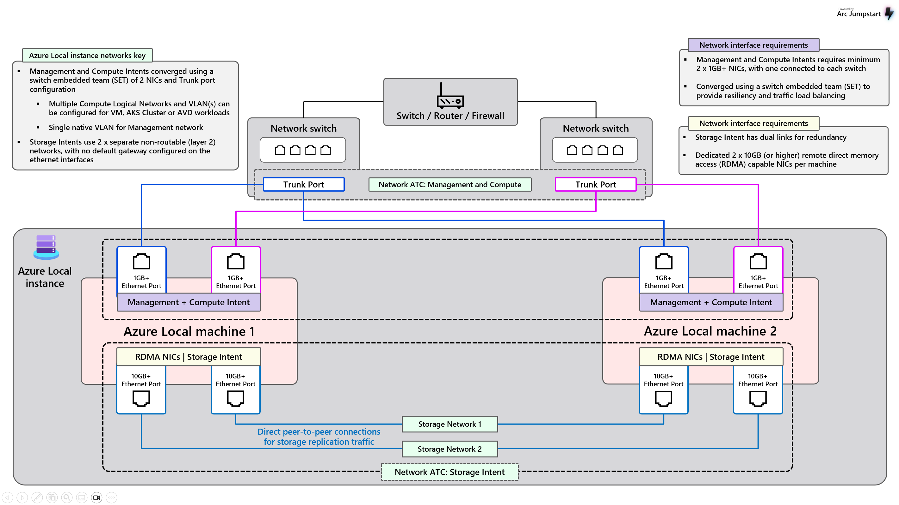

# Two Node Switchless Storage Configuration

**DRAFT**



## Terminology

- ToR: Top of Rack switch
- p-NIC: Physical Network Card attached to a node.
- v-Switch: Virutal Switch configured on the Azure Local Cluster.
- VLAN: Virutal Local Area Network.
- SET: Switch Embedded Teaming, supporting switch independant teaming.
- MLAG: (Multi-Chassis Link Aggregation) It's a technique that lets two or more network switches work together as if they were one big switch.

## Scope

This document is designed to aid an administrator persona designing a network architecture that meets thier cluster configuration. This document will offer network device architectures that support cluster configurations. It will also offer sample network configurations that supports this environment. Customer premis equipement such as the (Switch/Fireall/Rotuer) equipement is considered out of scope of the document.  This is considered existing customer infrastructure that supports the customer network fabric. The document will focus on Node to ToR and ToR to ToR configurations, it will also disucss uplink configurations from the ToR perspective.

## Two Node Switchless environment

In this configuration, this is a two node environment using a switchless storage configuration.  Storage traffic is directly connected from node to node and bypasses using a switch.  The switch in this environemnt is design to only support Compute/Management traffic intents.  These network intents will have the ability to utilize both ToR devcies to operate the cluster environment. The p-NIC's supporting Compute/Managment are utilizing SET switch independant teaming to communicate with the physical network devices.  

## Attributes

The two node converged networking configuration has the following attributes.

### Nodes

1. Two network cards, each with two physical network interfaces cards also know as a p-NIC. p-NIC A and p-NIC B.
2. p-NIC A: will maintan the Compute and Management traffic intents.
3. p-NIC A: will be configured as a SET team, where Compute and Management will be transmitted as a VLAN Tag.  These NICs are assigned to a Virtual Switch (v-Switch) to support the multiple network intents.
4. p-NIC B: will manage the Storage intent traffic and support RDMA protocol workloads.
5. p-NIC B: is directly connected from node 1 to Node 2. The nodes will transmit traffic utilizing VLAN tags.

## Switches

- Two physical switches are utilized in this example design acting as the Top of Rack (ToR) network device.
- Management/Compute intent p-NIC's will connect to the ToR devices.
- Storage intent p-NIC's do not have any links to the ToR devices.  
- The ToR's are in a MLAG configuration to support a redundant swithcing infrastructure.
- Switch/Router/Firewall is simbolic device acting as a Core device where traffic will be sent to reach an off cluster destinations.  This can be Azure or other endpoints on the customers local network.  This set of devices can be a router, set of switch/routers and or a firewall. This devices configuration will not be covered in the network design and is considered out of scope.

## Switch Configuration

### QOS policy

In this configuration, switch QOS is not required or used.  QOS is typically used on the storage intent interfaces if they are connected to a switch. For this specific configuration, Node 1 and Node 2 Storage intents are connected back to back.  The storage intents do not utilze a switch in a switchless configuration.

### Compute, Management Intent Networks

In the image above compute and management intents are separated into VLANs 7 and 8.  These VLAN id's used here are for example purposes.  Its expected that the admin will designate the desired VLAN ids. These VLAN's are configured as Layer 3 Switch Virtual Interfaces (SVI) on both TOR1 and TOR2. MLAG is used to support east-west traffic for the compute and management intents.

## ToR 1 Configuration

```console
vlan 7
  name Management_7
vlan 8
  name Compuate_8
!
interface Vlan7
  description Management
  no shutdown
  mtu 9216
  no ip redirects
  ip address 100.101.176.2/24
  no ipv6 redirects
  hsrp version 2
  hsrp 7 
    priority 150 forwarding-threshold lower 1 upper 150
    ip 100.101.176.1
!
interface Vlan8
  description Compute
  no shutdown
  mtu 9216
  no ip redirects
  ip address 100.101.177.2/24
  no ipv6 redirects
  hsrp version 2
  hsrp 201 
    priority 150 forwarding-threshold lower 1 upper 150
    ip 100.101.177.1
!
interface Ethernet1/1
  description AzLocalNode1
  no cdp enable
  switchport
  switchport mode trunk
  switchport trunk native vlan 7
  switchport trunk allowed vlan 7-8
  spanning-tree port type edge trunk
  mtu 9216
  speed 10000
  no logging event port link-status
  no shutdown
!
interface Ethernet1/2
  description AzLocalNode2
  no cdp enable
  switchport
  switchport mode trunk
  switchport trunk native vlan 7
  switchport trunk allowed vlan 7-8
  spanning-tree port type edge trunk
  mtu 9216
  speed 10000
  no logging event port link-status
  no shutdown
```

## Reference Documents

- [Network considerations for cloud deployments of Azure Local](https://learn.microsoft.com/en-us/azure/azure-local/plan/cloud-deployment-network-considerations)
- [Physical network requirements for Azure Local](https://learn.microsoft.com/en-us/azure/azure-local/concepts/physical-network-requirements)
- [Teaming in Azure Stack HCI](https://techcommunity.microsoft.com/blog/networkingblog/teaming-in-azure-stack-hci/1070642)
