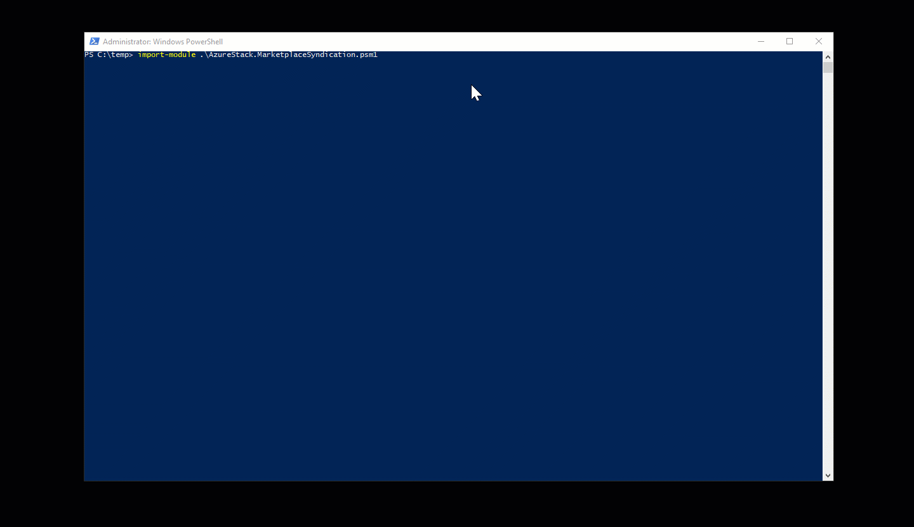

# Offline Marketplace Syndication

When Azure Stack is deployed in disconnect mode (Without Internet connectivity) you can
not use the build in portal feature to syndicate Azure Market place items and make them
available to your users.

This Tool allows you to download Azure Marketplace Items with a machine that has internet connectivity and side load them.
The downloaded needs to transferred to machine with has connectivity to the Azure Stack deployment and imported.



## Requirements

- Azure Stack RP registered within your Azure Subscription

- Azure Subscription used to register Azure Stack System (Multi Node or ASDK)
- AzureRM 1.2.11 PowerShell needs to be installed

(https://docs.microsoft.com/en-us/azure/azure-stack/azure-stack-powershell-configure-quickstart)


## Import the Module
```powershell
Import-Module .\AzureStack.MarketplaceSyndication.psm1
```


## Launch the Tool
```powershell
Sync-AzSOfflineMarketplaceItem -destination c:\donwloadfolder -AzureTenantID "Value" -AzureSubscriptionID "SubsciptionID"

```

## Optional Parameters

Parameter: Cloud

Default: AzureCloud

Description: Once Azure Stack RP is available in other Clouds like Azure China you can specify which one to use


Parameter: AzureTenantID

Description: Specify the Azure Tenant ID for Authentication


Parameter: SubscriptionID

Description: Specify the Azure Subscription ID for Authentication when having multiple subscriptions

## Importing into Azure Stack

Once the download has been transferred to a machine that can access Azure Stack, you need to import the VHD and publish the Gallery Item.


## Importing the VHD
You can use the Portal or PowerShell.

https://docs.microsoft.com/en-us/azure/azure-stack/azure-stack-add-vm-image

## Publishing the Gallery Item
You need to use PowerShell

https://docs.microsoft.com/en-us/azure/azure-stack/azure-stack-create-and-publish-marketplace-item
