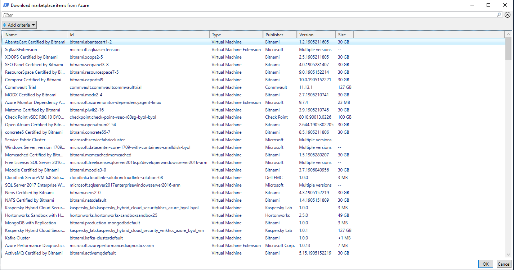
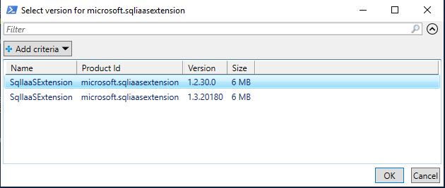
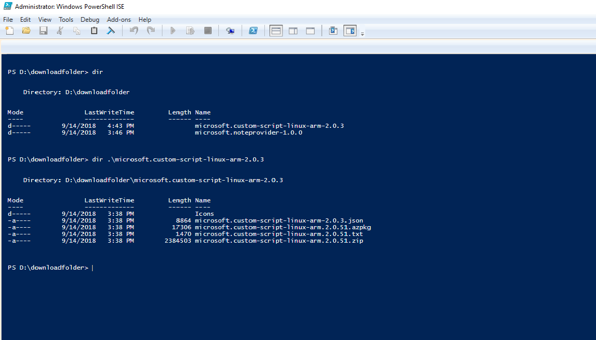

# Offline Marketplace Syndication

When Azure Stack is deployed in disconnect mode (Without Internet connectivity) you can
not use the built-in portal feature to syndicate marketplace items and resource providers from Azure and make them
available to your users.

This powershell command set will allow you to download marketplace items and resource providers from Azure with a machine that has internet connectivity and side load them.
The downloaded items need to be transferred to a machine which has connectivity to the Azure Stack deployment before importing them.
The powershell command will provide method to both download and upload the items. 

## Requirements

- Azure Stack RP registered within your Azure Subscription

- Azure Subscription used to register Azure Stack System (Multi Node or ASDK)
- AzureStack PowerShell needs to be installed

(https://docs.microsoft.com/en-us/azure/azure-stack/azure-stack-powershell-install)

- Optional: For best download performance (Premium Download) Azure Storage Tools are required
(http://aka.ms/downloadazcopy)


## Downloading marketplace items or resource providers from Azure

The tool will allow you to download a marletplace item or resource provider along with its dependencies from Azure.

From powershell, add the Azure account that you have used to register Azure Stack
```powershell
Add-AzureRmAccount -EnvironmentName "<Name>"
```
If you have more than one subscription for your account, you will need to select the previously used subscription for Azure Stack registration 
```powershell
Get-AzureRmSubscription -SubscriptionID '<Your Azure Subscription GUID>' | Select-AzureRmSubscription
```

Import the module and start the export process for a marketplace item or resource provider
```powershell
Import-Module .\AzureStack.MarketplaceSyndication.psm1
```
- To start the export process for a marketplace item, run below cmdlet
```powershell
Export-AzSOfflineMarketplaceItem -destination "[Destination folder path]" -azCopyDownloadThreads "[AzCopy threads number]" -azureContext "[Specified Azure context]"
```
- To start the export process for a resource provider, run below cmdlet
```powershell
Export-AzSOfflineResourceProvider -destination "[Destination folder path]" -azCopyDownloadThreads "[AzCopy threads number]" -azureContext "[Specified Azure context]"
```

Parameter -azCopyDownloadThreads is optional. It should only be used when you have low-bandwidth network, and you are using premium download. This option is to specifies the number of concurrent operations in AzCopy. If you are running across a low-bandwidth network, you can specify a lower number to avoid failure caused by resource competition.
You can see more details at https://docs.microsoft.com/en-us/azure/storage/common/storage-use-azcopy#specify-the-number-of-concurrent-operations-to-start
Parameter -azureContext is optional. If user do not specified the Azure context, then the cmdlet will use the default Azure context.

For both marketplace items and resource providers downloading, you will be prompted to select a product first.


If the selected production has multiple versions, you will be promopted to select a version for the product and start downloading. Otherwise, the downloading will start directly after the product is selected.


After download completion, the item will be available in the folder specified in the script.


## Validating the downloaded marketplace item or resource Provider
Configure Azure Stack Operator’s PowerShell session. More information can be found here https://docs.microsoft.com/en-us/azure/azure-stack/azure-stack-powershell-configure-admin
The following command will run a set of test against a downloaded marketplace item or reesource provider. It is highly recommended to validate the download before proceeding to the next steps.
```powershell
Test-AzSOfflineMarketplaceItem -Destination "[marketplace content folder]"
```

## Importing the downloaded marketplace item or resource provider to your Azure Stack Marketplace
The previous downloaded files will need to be made available to your Azure Stack environment. The following structure showcase how the folder structure and files should look like


Configure Azure Stack Operator's PowerShell session. More information can be found here https://docs.microsoft.com/en-us/azure/azure-stack/azure-stack-powershell-configure-admin

Import the module and start the import process for an marketplace item or resource provider
```powershell
Import-Module .\AzureStack.MarketplaceSyndication.psm1
$credential = Get-Credential -Message "Enter the azure stack operator credential"
Import-AzSOfflineMarketplaceItem -origin "[marketplace content folder]" -AzsCredential $credential
```

Option -Origin needs to be the top level folder contains all the downloaded products. In the example above, Origin should be "D:\downloadfolder".
Option -AzsCredential is optional, it is used to renew access token in case token expires. 

## Downloaded Content

Files (VHD, ZIP and AZPKG) associated with a gallery items are stored in the destination folder. This destination folder must be transferred for import to a machine that can access Azure Stack.


## Working with disconnected Azure Stack

Additional resources on how to work with disconnected Azure Stack. You can also use the following method to import VM and VM extension.

### Importing the VHD
For detailed steps to use the Portal see:

https://docs.microsoft.com/en-us/azure/azure-stack/azure-stack-add-vm-image

For detailed steps using PowerShell see:

https://docs.microsoft.com/en-us/powershell/module/azs.compute.admin/add-azsplatformimage?view=azurestackps-1.4.0


### Publishing the Gallery Item
For detailed steps using PowerShell see:

https://docs.microsoft.com/en-us/powershell/module/azs.gallery.admin/add-azsgalleryitem?view=azurestackps-1.4.0

### Publishing VM Extensions
For detailed steps using PowerShell see:

https://docs.microsoft.com/en-us/powershell/module/azs.compute.admin/add-azsvmextension?view=azurestackps-1.4.0

